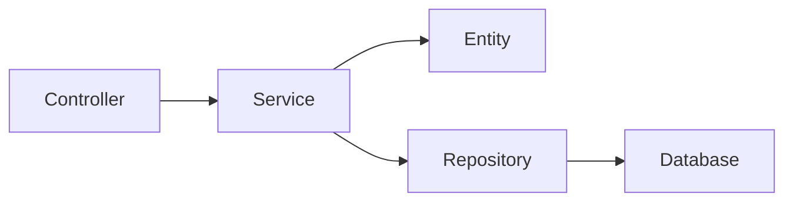
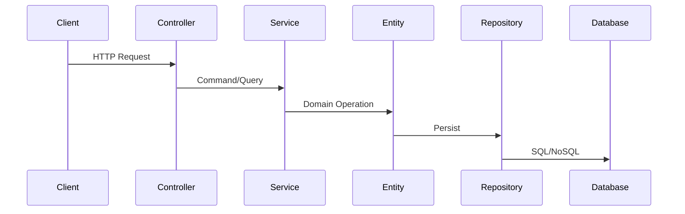

# Create Skill（技能生成器）

> **路径**：`.claude/skills/project-create-skill/SKILL.md`
> **用途**：根据不同的 Skill 类别，生成标准化的 Skill 文件
> **触发条件**：由 Architect-Agent 在 Stage-0 调用，用于生成业务 Skills

---

## Skill 元数据

```yaml
name: project-create-skill
name_zh: 技能生成器
category: meta
version: 1.0.0
author: Architect Agent
created: 2026-06-03
trigger: manual
description: 根据模板生成标准化的 Skill 文件
```

---

## 1. 概述

Create Skill 是用于生成其他 Skills 的元技能（Meta-Skill）。它根据不同的 Skill 类别，使用对应的模板生成标准化的 Skill 文件。

### 1.1 生成的 Skill 文件结构

每个生成的 Skill 包含：

| 文件 | 必需 | 说明 |
|------|------|------|
| `SKILL.md` | ✅ 必须 | Skill 主文件，包含 front matters 和核心内容 |
| `references/` | ✅ 必须 | 代码示例目录 |
| `scripts/` | ❌ 可选 | 自动化脚本 |

### 1.2 Skill 分类与模板对应

| Skill 类别 | 模板类型 | 生成路径 |
|------------|---------|---------|
| 功能元素类（业务应用层） | Feature Skill | `.claude/skills/project-feature-{name}/` |
| 底层基础类 | Infra Skill | `.claude/skills/project-infra-{name}/` |
| 框架/中间件类 | Framework Skill | `.claude/skills/project-framework-{name}/` |
| 工具类 | Utils Skill | `.claude/skills/project-utils-{name}/` |
| 开发工作流类 | Workflow Skill | `.claude/skills/project-workflow-{name}/` |
| 部署工作流类 | Deploy Skill | `.claude/skills/project-deploy-{name}/` |

---

## 2. Feature Skill 模板（业务应用层）

> **用途**：基于 L5 业务场景生成，垂直整合 L1-L4 的完整业务功能 Skill

### 2.1 目录结构

```
.claude/skills/project-feature-{feature-name}/
├── SKILL.md                    # 必需：Skill 主文件
├── references/                 # 必需：代码示例
│   ├── entity.ts               # 领域实体示例
│   ├── service.ts              # 应用服务示例
│   ├── api.ts                  # 接口层示例
│   └── data-flow.ts            # 数据流示例
└── scripts/                    # 可选：自动化脚本
    └── generate-feature.sh     # 生成脚本
```

### 2.2 SKILL.md 结构

```markdown
# Feature Skill: {feature-name}

> **路径**：`.claude/skills/project-feature-{name}/SKILL.md`
> **用途**：{feature} 业务功能的开发规范
> **来源**：基于 L5 场景 {scene-id} 生成

---

## Skill 元数据

```yaml
name: project-feature-{name}
name_zh: {中文名称}
category: feature
version: 1.0.0
author: Architect Agent
created: {timestamp}
source: L5 Scene {scene-id}
trigger: auto-generate
```

---

## 1. Feature 描述

> {feature} 的业务描述和核心价值

| 项目 | 内容 |
|------|------|
| **功能名称** | {name} |
| **业务场景** | {scene-id} |
| **核心职责** | {responsibility} |
| **外部依赖** | {dependencies} |

---

## 2. Feature 组织结构

> {feature} 涉及的代码元素及其文件位置

### 2.1 涉及的元素

| 元素类型 | 元素名称 | 文件路径 | 说明 |
|----------|----------|----------|------|
| **L2 领域实体** | {entity-name} | `{path}` | {description} |
| **L3 应用服务** | {service-name} | `{path}` | {description} |
| **L4 接口** | {api-endpoint} | `{path}` | {description} |
| **L1 基础设施** | {infra-component} | `{path}` | {description} |

### 2.2 文件组织结构

```
{src/}
├── features/
│   └── {feature-name}/
│       ├── domain/                 # L2 领域层
│       │   ├── entities/
│       │   │   └── {entity}.ts
│       │   ├── value-objects/
│       │   │   └── {vo}.ts
│       │   └── services/
│       │       └── {domain-service}.ts
│       ├── application/            # L3 应用层
│       │   ├── services/
│       │   │   └── {service}.ts
│       │   ├── commands/
│       │   └── queries/
│       ├── infrastructure/         # L1 基础设施
│       │   ├── repositories/
│       │   └── {infra-implementation}.ts
│       └── interfaces/            # L4 接口层
│           ├── controllers/
│           │   └── {controller}.ts
│           ├── routes/
│           │   └── {routes}.ts
│           └── dto/
│               └── {dto}.ts
```

---

## 3. Feature 元素关系

> {feature} 内部各元素之间的关系

### 3.1 类关系图



### 3.2 关系类型

| 关系类型 | 源 → 目标 | 说明 |
|----------|-----------|------|
| **继承** | {parent} → {child} | {description} |
| **抽象** | {interface} → {impl} | {description} |
| **注册** | {feature} → {registry} | {description} |
| **IS-A** | {entity} IS-A {base} | {description} |
| **HAS-A** | {entity} HAS-A {component} | {description} |

---

## 4. Feature 状态与 Action

> {feature} 的状态机定义和可执行的操作

### 4.1 状态定义

| 状态 | 说明 | 触发条件 |
|------|------|---------|
| {state-1} | {description} | {trigger} |
| {state-2} | {description} | {trigger} |

### 4.2 Action 定义

| Action | 状态转换 | 前置条件 | 后置条件 |
|--------|----------|----------|----------|
| {action-1} | {from} → {to} | {precondition} | {postcondition} |
| {action-2} | {from} → {to} | {precondition} | {postcondition} |

---

## 5. Feature 数据流

> {feature} 的数据流转方式

### 5.1 数据传递方式

| 层级间传递 | 方式 | 说明 |
|------------|------|------|
| L4 → L3 | DTO / Request Object | 接口层传入应用层 |
| L3 → L2 | Domain Object | 应用服务调用领域实体 |
| L2 → L1 | Repository Interface | 领域实体通过仓储持久化 |

### 5.2 数据流图



---

## 6. Feature 业务流

> {feature} 的核心业务流程

### 6.1 业务流程描述

```
{业务流程步骤}
1. {step-1}
2. {step-2}
3. {step-3}
```

### 6.2 异常处理流程

| 异常场景 | 处理方式 | 回滚操作 |
|----------|----------|----------|
| {error-scenario-1} | {handling} | {rollback} |
| {error-scenario-2} | {handling} | {rollback} |

---

## 7. Feature 外部依赖

> {feature} 依赖的外部元素

| 依赖元素 | 依赖类型 | 集成方式 |
|----------|----------|----------|
| {external-element} | {type} | {integration} |

---

## 8. Code Reference（代码示例）

| 示例 | 文件路径 | 说明 |
|------|----------|------|
| 领域实体 | `references/entity.ts` | 实体定义和关系 |
| 应用服务 | `references/service.ts` | 服务实现 |
| 接口定义 | `references/api.ts` | REST API 定义 |
| 数据流 | `references/data-flow.ts` | 完整数据流转 |

---

## 与其他 Skill 的关系

```yaml
depends_on:
  - project-infra-database    # 数据库基础设施
  - project-infra-cache       # 缓存基础设施
  - project-naming-convention  # 命名规范
provides_to:
  - dev-stage4               # 为 Dev Agent 提供开发规范
```
```

---

## 3. 使用流程

### 3.1 调用 Create Skill

```bash
# 1. 读取 L5 场景清单
cat .claude/context/l5-scenes清单.md

# 2. 对每个场景调用 Create Skill 生成
for SCENE in $(cat l5-scenes清单.md | grep "^| BS-" | cut -d'|' -f2); do
    SCENE_NAME=$(echo $SCENE | tr ' ' '-')
    SKILL_DIR=".claude/skills/project-feature-$SCENE_NAME"
    mkdir -p "$SKILL_DIR/references"
    # 生成 SKILL.md
    # 生成 references/*
done
```

### 3.2 Graphify 查询获取 Feature 元素

```bash
# 查询领域实体
graphify query "What domain entities are related to {feature}"

# 查询应用服务
graphify query "What application services handle {feature}"

# 查询 API 端点
graphify query "What API endpoints are for {feature}"

# 查询数据流
graphify query "What is the data flow for {feature} business process"
```

---

## 4. 生成的 Skill 命名规范

所有生成的 Skill 文件必须以 `project-` 开头：

| 类别 | 命名格式 | 示例 |
|------|---------|------|
| 功能元素类 | `project-feature-{name}` | `project-feature-user-auth` |
| 底层基础类 | `project-infra-{name}` | `project-infra-database` |
| 框架/中间件类 | `project-framework-{name}` | `project-framework-springboot` |
| 工具类 | `project-utils-{name}` | `project-utils-logging` |
| 开发工作流类 | `project-workflow-{name}` | `project-workflow-git` |
| 部署工作流类 | `project-deploy-{name}` | `project-deploy-docker` |

---

## 5. 更新 consistency-baseline.md

生成完 Skill 后，需要更新 `consistency-baseline.md` 的第五部分：

```bash
# 更新 Skills 索引表
SKILL_FILE=".claude/context/consistency-baseline.md"
SKILL_ENTRY="| project-feature-{name}.md | 业务应用层 | {description} | P5 |"

# 在 5.4 Skills 索引表中追加
sed -i "/| project-feature-/a $SKILL_ENTRY" $SKILL_FILE
```

---

## Scripts（执行脚本）

| 脚本名 | 路径 | 说明 |
|--------|------|------|
| create-feature-skill.sh | `scripts/create-feature-skill.sh` | 生成 Feature Skill |
| create-infra-skill.sh | `scripts/create-infra-skill.sh` | 生成 Infra Skill |
| update-skills-index.sh | `scripts/update-skills-index.sh` | 更新 Skills 索引 |

---

## 与其他 Skill 的关系

```yaml
depends_on:
  - graphify-query-cheatsheet  # Graphify 查询能力
provides_to:
  - architect-stage0           # 为 Architect 提供 Skill 生成能力
  - dev-stage4                 # 为 Dev Agent 提供开发规范
```
