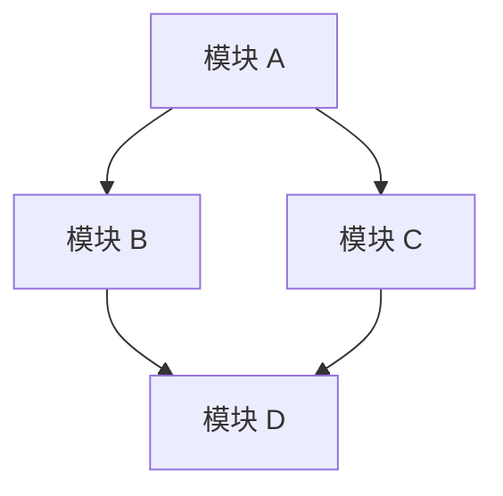

# 依赖全景图
> 文件路径：`.claude/context/dependencies-overview.md`
> 更新时机：阶段 0 初始化，架构师基于知识图谱生成
> **用途**：展示项目核心模块的依赖关系，为架构决策提供参考

---

## 核心模块列表

| 序号 | 模块名称 | 模块路径 | 职责描述 | 入口文件 |
|------|---------|---------|---------|---------|
| 1 | | | | |
| 2 | | | | |
| 3 | | | | |

---

## 模块依赖关系图（Mermaid）

---

## 核心模块依赖详情

### 模块 1：{模块名称}

| 依赖类型 | 依赖模块 | 依赖说明 | 证据文件 |
|---------|---------|---------|---------|
| **内部依赖** | | | |
| 模块 B | | 用途说明 | `src/xxx.ts:12` |
| 模块 C | | 用途说明 | `src/xxx.ts:45` |
| **外部依赖** | | | |
| 库/框架 | | 版本约束 | `package.json` |

### 模块 2：{模块名称}

| 依赖类型 | 依赖模块 | 依赖说明 | 证据文件 |
|---------|---------|---------|---------|
| **内部依赖** | | | |
| 模块 C | | 用途说明 | `src/xxx.ts:12` |
| **外部依赖** | | | |
| 库/框架 | | 版本约束 | `package.json` |

---

## 外部依赖清单

### 前端依赖（package.json）

| 依赖包 | 版本 | 用途 | 是否关键依赖 |
|--------|------|------|------------|
| | | | 是/否 |
| | | | 是/否 |

### 后端依赖

| 依赖包 | 版本 | 用途 | 是否关键依赖 |
|--------|------|------|------------|
| | | | 是/否 |
| | | | 是/否 |

---

## 依赖关系矩阵

> 行依赖列：✓ 表示行模块依赖列模块

| | 模块 A | 模块 B | 模块 C | 模块 D |
|--|--------|--------|--------|--------|
| **模块 A** | - | ✓ | ✓ | |
| **模块 B** | | - | | ✓ |
| **模块 C** | | | - | ✓ |
| **模块 D** | | | | - |

---

## 关键发现

### 循环依赖检测
> 检测是否存在循环依赖

| 检测结果 | 说明 |
|---------|------|
| ✅ 无循环依赖 | |
| ⚠️ 存在循环依赖 | 模块 A → 模块 B → 模块 A |

### 关键路径分析
> 从入口文件到核心模块的最长依赖链

| 路径 | 长度 | 说明 |
|------|------|------|
| | | |

### 依赖层次结构
| 层级 | 模块数量 | 示例模块 |
|------|---------|---------|
| L1（顶层） | | |
| L2 | | |
| L3（底层） | | |

---

## 潜在风险

| 风险类型 | 描述 | 影响模块 | 建议 |
|---------|------|---------|------|
| 紧耦合 | | | |
| 版本冲突 | | | |
| 单点故障 | | | |

---

## 备注

| 备注项 | 内容 |
|--------|------|
| 统计时间 | |
| 分析方法 | 知识图谱 / 手动扫描 |
| 缺失信息 | |