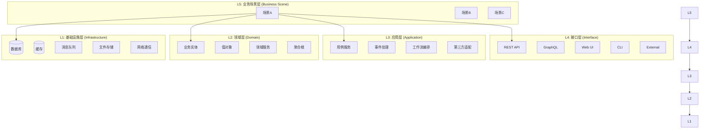

# Feature Elements（系统功能元素清单）

> 文件：`.claude/context/feature-elements.md`
> 用途：为每个 Feature Element 生成独立的 Skill，供 Stage 2 生成 ADR 时引用
> 更新时机：阶段 0 初始化，架构分析完成后

---

## 1. 系统架构图



---

## 2. 层次说明

| 层次 | 名称 | 说明 | 采集方式 |
|------|------|------|---------|
| **L1** | 基础设施层 | 数据库、缓存、消息队列、文件存储、网络通信 | 从依赖文件检测（pom.xml / requirements.txt / package.json） |
| **L2** | 领域层 | 业务实体、值对象、领域服务、聚合根 | 从知识图谱分析 + 用户确认 |
| **L3** | 应用层 | 用例服务、事件处理、工作流编排、第三方适配器 | 从知识图谱分析 + 用户确认 |
| **L4** | 接口层 | REST API、GraphQL、Web UI、CLI、第三方集成 | 从知识图谱分析 + 用户确认 |
| **L5** | 业务场景层 | 横跨 L1-L4 的完整业务流程 | 从知识图谱分析 + 用户确认 |

---

## 3. Feature Element 清单

### 3.1 Layer 1: 基础设施层（Infrastructure）

> 静态基础类别（每个系统都有）+ 动态检测实际技术栈

| Element ID | 名称（静态类别） | 描述（检测到的技术） | 类别 | 依赖来源 | 代码 Reference |
|------------|------------------|---------------------|------|---------|--------------|
| FE-I-001 | 数据库（DB） | `{动态检测}` | infrastructure | `{检测到的}` | `[待填写]` |
| FE-I-002 | 缓存（Cache） | `{动态检测}` | infrastructure | `{检测到的}` | `[待填写]` |
| FE-I-003 | 文件系统（FileSystem） | `{动态检测}` | infrastructure | `{检测到的}` | `[待填写]` |
| FE-I-004 | 网络通信（Network） | `{动态检测}` | infrastructure | `{检测到的}` | `[待填写]` |
| FE-I-005 | 消息队列（MessageQueue） | `{动态检测}` | infrastructure | `{检测到的}` | `[待填写]` |
| FE-I-006 | 安全认证（Security） | `{动态检测}` | infrastructure | `{检测到的}` | `[待填写]` |
| FE-I-007 | 日志（Logging） | `{动态检测}` | infrastructure | `{检测到的}` | `[待填写]` |
| FE-I-008 | 配置管理（Config） | `{动态检测}` | infrastructure | `{检测到的}` | `[待填写]` |

### 3.2 Layer 2: 领域层（Domain）

| Element ID | 名称 | 描述 | 类别 | 涉及模块 | 代码 Reference |
|------------|------|------|------|---------|--------------|
| FE-D-001 | `{动态检测}` | `{动态检测}` | domain | `{动态检测}` | `[待填写]` |
| FE-D-002 | `{动态检测}` | `{动态检测}` | domain | `{动态检测}` | `[待填写]` |
| FE-D-003 | `{动态检测}` | `{动态检测}` | domain | `{动态检测}` | `[待填写]` |
| FE-D-004 | `{动态检测}` | `{动态检测}` | domain | `{动态检测}` | `[待填写]` |

### 3.3 Layer 3: 应用层（Application）

| Element ID | 名称 | 描述 | 类别 | 涉及用例 | 代码 Reference |
|------------|------|------|------|---------|--------------|
| FE-A-001 | `{动态检测}` | `{动态检测}` | application | `{动态检测}` | `[待填写]` |
| FE-A-002 | `{动态检测}` | `{动态检测}` | application | `{动态检测}` | `[待填写]` |
| FE-A-003 | `{动态检测}` | `{动态检测}` | application | `{动态检测}` | `[待填写]` |
| FE-A-004 | `{动态检测}` | `{动态检测}` | application | `{动态检测}` | `[待填写]` |

### 3.4 Layer 4: 接口层（Interface）

| Element ID | 名称 | 描述 | 类别 | 协议/技术 | 代码 Reference |
|------------|------|------|------|---------|--------------|
| FE-F-001 | `{动态检测}` | `{动态检测}` | interface | `{动态检测}` | `[待填写]` |
| FE-F-002 | `{动态检测}` | `{动态检测}` | interface | `{动态检测}` | `[待填写]` |
| FE-F-003 | `{动态检测}` | `{动态检测}` | interface | `{动态检测}` | `[待填写]` |
| FE-F-004 | `{动态检测}` | `{动态检测}` | interface | `{动态检测}` | `[待填写]` |
| FE-F-005 | `{动态检测}` | `{动态检测}` | interface | `{动态检测}` | `[待填写]` |

### 3.5 Layer 5: 业务场景层（Business Scene）

| Scene ID | 场景名称 | 涉及 L2 实体 | 涉及 L3 服务 | 涉及 L4 接口 | Skill 文件 |
|----------|----------|-------------|--------------|--------------|------------|
| BS-001 | `{动态检测}` | `{动态检测}` | `{动态检测}` | `{动态检测}` | SKILL-{场景}.md |
| BS-002 | `{动态检测}` | `{动态检测}` | `{动态检测}` | `{动态检测}` | SKILL-{场景}.md |

---

## 4. Feature Element 详情

### 4.1 基础设施层详情

#### FE-I-001: 数据库（DB）

| 字段 | 内容 |
|------|------|
| **Element ID** | FE-I-001 |
| **名称** | 数据库（DB） |
| **描述** | `{动态检测}` |
| **类别** | infrastructure |
| **依赖来源** | `{动态检测}` |
| **代码 Reference** | `{动态检测}` |
| **文件位置** | `{动态检测}` |
| **主要类/函数** | `{动态检测}` |

#### FE-I-002: 缓存（Cache）

| 字段 | 内容 |
|------|------|
| **Element ID** | FE-I-002 |
| **名称** | 缓存（Cache） |
| **描述** | `{动态检测}` |
| **类别** | infrastructure |
| **依赖来源** | `{动态检测}` |
| **代码 Reference** | `{动态检测}` |
| **文件位置** | `{动态检测}` |
| **主要类/函数** | `{动态检测}` |

#### FE-I-003: 文件系统（FileSystem）

| 字段 | 内容 |
|------|------|
| **Element ID** | FE-I-003 |
| **名称** | 文件系统（FileSystem） |
| **描述** | `{动态检测}` |
| **类别** | infrastructure |
| **依赖来源** | `{动态检测}` |
| **代码 Reference** | `{动态检测}` |
| **文件位置** | `{动态检测}` |
| **主要类/函数** | `{动态检测}` |

#### FE-I-004: 网络通信（Network）

| 字段 | 内容 |
|------|------|
| **Element ID** | FE-I-004 |
| **名称** | 网络通信（Network） |
| **描述** | `{动态检测}` |
| **类别** | infrastructure |
| **依赖来源** | `{动态检测}` |
| **代码 Reference** | `{动态检测}` |
| **文件位置** | `{动态检测}` |
| **主要类/函数** | `{动态检测}` |

#### FE-I-005: 消息队列（MessageQueue）

| 字段 | 内容 |
|------|------|
| **Element ID** | FE-I-005 |
| **名称** | 消息队列（MessageQueue） |
| **描述** | `{动态检测}` |
| **类别** | infrastructure |
| **依赖来源** | `{动态检测}` |
| **代码 Reference** | `{动态检测}` |
| **文件位置** | `{动态检测}` |
| **主要类/函数** | `{动态检测}` |

#### FE-I-006: 安全认证（Security）

| 字段 | 内容 |
|------|------|
| **Element ID** | FE-I-006 |
| **名称** | 安全认证（Security） |
| **描述** | `{动态检测}` |
| **类别** | infrastructure |
| **依赖来源** | `{动态检测}` |
| **代码 Reference** | `{动态检测}` |
| **文件位置** | `{动态检测}` |
| **主要类/函数** | `{动态检测}` |

#### FE-I-007: 日志（Logging）

| 字段 | 内容 |
|------|------|
| **Element ID** | FE-I-007 |
| **名称** | 日志（Logging） |
| **描述** | `{动态检测}` |
| **类别** | infrastructure |
| **依赖来源** | `{动态检测}` |
| **代码 Reference** | `{动态检测}` |
| **文件位置** | `{动态检测}` |
| **主要类/函数** | `{动态检测}` |

#### FE-I-008: 配置管理（Config）

| 字段 | 内容 |
|------|------|
| **Element ID** | FE-I-008 |
| **名称** | 配置管理（Config） |
| **描述** | `{动态检测}` |
| **类别** | infrastructure |
| **依赖来源** | `{动态检测}` |
| **代码 Reference** | `{动态检测}` |
| **文件位置** | `{动态检测}` |
| **主要类/函数** | `{动态检测}` |

### 4.2 领域层详情

#### FE-D-001: `{动态检测}`

| 字段 | 内容 |
|------|------|
| **Element ID** | FE-D-001 |
| **名称** | `{动态检测}` |
| **描述** | `{动态检测}` |
| **类别** | domain |
| **涉及模块** | `{动态检测}` |
| **代码 Reference** | `{动态检测}` |
| **文件位置** | `{动态检测}` |
| **主要属性** | `{动态检测}` |
| **主要方法** | `{动态检测}` |
| **聚合根** | `{动态检测}` |
| **关联实体** | `{动态检测}` |

### 4.3 应用层详情

#### FE-A-001: `{动态检测}`

| 字段 | 内容 |
|------|------|
| **Element ID** | FE-A-001 |
| **名称** | `{动态检测}` |
| **描述** | `{动态检测}` |
| **类别** | application |
| **涉及用例** | `{动态检测}` |
| **代码 Reference** | `{动态检测}` |
| **文件位置** | `{动态检测}` |
| **依赖领域实体** | `{动态检测}` |
| **依赖基础设施** | `{动态检测}` |
| **事件发布** | `{动态检测}` |
| **事件订阅** | `{动态检测}` |

### 4.4 接口层详情

#### FE-F-001: `{动态检测}`

| 字段 | 内容 |
|------|------|
| **Element ID** | FE-F-001 |
| **名称** | `{动态检测}` |
| **描述** | `{动态检测}` |
| **类别** | interface |
| **协议/技术** | `{动态检测}` |
| **代码 Reference** | `{动态检测}` |
| **端点路径** | `{动态检测}` |
| **请求/响应格式** | `{动态检测}` |
| **认证方式** | `{动态检测}` |
| **调用应用服务** | `{动态检测}` |

### 4.5 业务场景层详情

#### BS-001: `{动态检测}`

| 字段 | 内容 |
|------|------|
| **Scene ID** | BS-001 |
| **场景名称** | `{动态检测}` |
| **描述** | `{动态检测}` |
| **涉及 L2 实体** | `{动态检测}` |
| **涉及 L3 服务** | `{动态检测}` |
| **涉及 L4 接口** | `{动态检测}` |
| **涉及 L1 依赖** | `{动态检测}` |
| **Skill 文件** | SKILL-{场景}.md |
| **代码 Reference** | `{动态检测}` |

---

## 5. Feature Element 依赖关系矩阵

| Source \ Target | FE-I-001 | FE-I-002 | FE-D-001 | FE-A-001 | FE-F-001 |
|-----------------|----------|----------|----------|----------|----------|
| **FE-D-001** | uses | - | - | - | - |
| **FE-A-001** | - | uses | uses | - | - |
| **FE-F-001** | - | - | - | uses | - |

---

## 6. Graphify 查询模板（用于动态发现 L1-L5）

```
# L1 基础设施层查询
graphify query "What infrastructure components are used in this project"
graphify query "What databases, caches, message queues are configured"

# L2 领域层查询
graphify query "What are the main domain entities or business objects"
graphify query "What domain services or business logic classes exist"
graphify query "What aggregates or aggregate roots are defined"

# L3 应用层查询
graphify query "What use case services or application services exist"
graphify query "What workflows or business process orchestration exist"
graphify query "What event handlers or pub/sub patterns exist"

# L4 接口层查询
graphify query "What REST endpoints or API routes are defined"
graphify query "What UI components, pages, or views exist"
graphify query "What external integrations or webhooks exist"

# L5 业务场景查询（跨层）
graphify query "What business scenarios or end-to-end workflows exist"
graphify query "What is the main business flow from API to database"
graphify query "What use cases span multiple layers"
```

---

## 7. L5 业务场景识别流程

> **说明**：L5 业务场景由用户访谈确认，识别结果将传递给 Architect Agent 用于生成业务 Skills

```
Graphify 分析结果
    ↓
识别跨层业务场景（动态发现，不写死）
    ↓
用户访谈：确认 L1-L4 检测结果 + 识别 L5 业务场景
    ↓
输出 L5 业务场景清单（Scene ID + 场景名称）
    ↓
→ Architect Agent 使用此清单生成业务 Skills
```