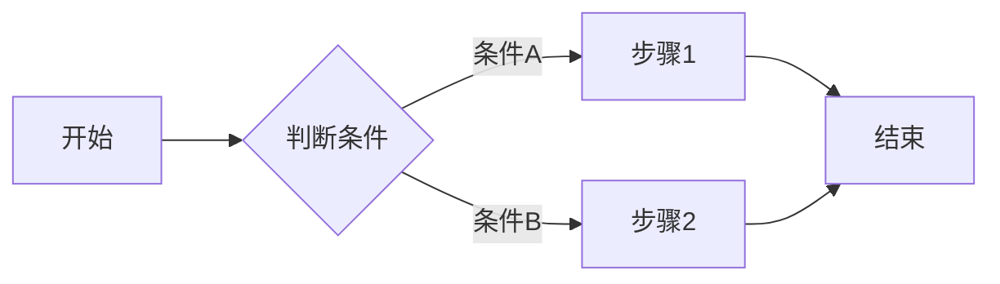

# 需求文档模板（二次开发场景）

> 文件路径：`.claude/iterations/sprint-latest/requirements.md`
>
> 更新时机：BA-Stage1 完成详细需求设计后生成
>
> **核心原则**：
> - 一个迭代 = 一个 requirements.md（不拆分多个文件）
> - 基于 feature.md 的每个 Feature 拆分为 User Story 和 Sub-feature
> - 验收标准使用 Gherkin 格式（Given/When/Then）

---

## 基本信息

| 字段 | 内容 |
|------|------|
| **需求标题** | {本次迭代的主题} |
| **关联迭代** | sprint-latest |
| **提出日期** | {日期} |
| **BA** | {名称} |
| **状态** | 🔍 进行中 / ✅ 已完成 |

---

## User Story 汇总表

> 所有拆分的 User Story 汇总

| US ID | 标题 | 优先级 | 关联 Feature | 依赖 US | 状态 |
|-------|------|--------|-------------|---------|------|
| US-001 | | P0/P1/P2 | FEATURE-XXX | - | ⏳ |
| US-002 | | | | | |
| ... | | | | | |

---

## Sub-feature 汇总表

> 所有拆分的 Sub-feature 汇总

| SF ID | 子功能名称 | 类型 | 所属 US | 优先级 | 依赖 SF | 状态 |
|-------|----------|------|---------|--------|--------|------|
| SF-001-1 | | frontend/backend/api/db/infra | US-001 | P0/P1/P2 | - | ⏳ |
| SF-001-2 | | | | | | |
| ... | | | | | | |

---

## 需求详情

### FEATURE-XXX：{功能名称}

---

#### US-{NNN}：{用户故事标题}

**用户故事**：
> 作为 {角色}，我想 {功能}，以便 {价值}。

**业务价值**：
| 价值类型 | 描述 |
|---------|------|
| 用户价值 | |
| 业务价值 | |
| 技术价值 | |

**优先级**：P0 / P1 / P2

**关联 Feature**：FEATURE-XXX

**依赖关系**：
| 类型 | 依赖项 | 说明 |
|------|--------|------|
| 前置依赖 US | US-XXX | 必须先完成 |
| 前置依赖 SF | SF-XXX | 必须先完成 |
| 被依赖关系 | US-YYY | 依赖本 US 的输出 |

**相似功能模块分析**：

> **填写规范**：必须明确指出参考的模块文件路径和方法名，供 Arch agent 生成伪代码
>
> **目的**：为 Arch-Stage2 的 Task 伪代码提供"仿照类似模块"的参考依据

| 功能描述 | 参考文件 | 行号范围 | 业务流程 | 复用的关键方法 | 技术栈 | 分析来源 |
|---------|---------|---------|---------|---------------|--------|---------|
| 评论功能参考帖子功能 | src/entity/Post.java | L20-50 | 发布→查询→分页 | findById(), findAllByPage() | Spring JPA | 自动 |
| 评论功能参考商品评价 | src/service/ReviewService.java | L30-60 | 评价→回复→删除 | create(), delete() | Spring Boot | 人类补充 |

> **分析来源**：`自动` = 自动化发现，`人类补充` = 人类补充，`混合` = 两者结合

**复用功能模块**：

> **填写规范**：必须列出需要调用的已有模块的接口，供 Arch agent 在伪代码中强制调用
>
> **目的**：为 Arch-Stage2 的 Task 伪代码提供"必须复用已有模块"的约束，禁止重新实现

| 模块名称 | 文件名 | 必须复用的接口 | 接口说明 | 禁止重新实现 |
|---------|--------|--------------|---------|-------------|
| 用户服务 | src/service/UserService.java | findById(Long id) | 获取用户信息用于权限校验 | 用户信息查询 | 自动 |
| 通知服务 | src/service/NotificationService.java | send(Long userId, String msg) | 发送通知 | 消息推送逻辑 | 人类补充 |

> **分析来源**：`自动` = 自动化发现，`人类补充` = 人类补充，`混合` = 两者结合

**风险评估**：
| 风险类型 | 描述 | 应对方案 |
|---------|------|---------|
| 技术实现难度 | | |
| 备选方案 | | |

---

##### 1. 功能描述

###### 1.1 数据说明

| 数据项 | 类型 | 说明 | 来源/去向 |
|--------|------|------|-----------|
| | | | |

###### 1.2 状态说明

| 状态 | 说明 | 触发条件 |
|------|------|---------|
| 状态A | | |
| 状态B | | |

###### 1.3 业务流程

###### 1.4 页面流程（前端时填写）

| 页面 | 组件 | 交互状态 |
|------|------|---------|
| 页面A | 组件X | 点击后跳转页面B |
| 页面B | 组件Y | 加载时显示loading |

---

##### 2. 验收标准（Gherkin 格式）

| AC ID | 场景 | Given | When | Then | 测试方法 |
|-------|------|-------|------|------|---------|
| AC-1 | 正常流程 | 前置条件 | 操作 | 预期结果 | 自动/手动 |
| AC-2 | 错误情况 | 前置条件 | 操作 | 预期错误 | 自动/手动 |
| AC-3 | 边界值 | 前置条件 | 操作 | 预期结果 | 自动/手动 |
| AC-4 | 异常恢复 | 前置条件 | 操作 | 预期结果 | 自动/手动 |

---

##### 3. 错误/边界/异常场景

###### 3.1 错误情况

| 错误场景 | 业务行为 | 处理方式 |
|---------|---------|---------|
| | | |

###### 3.2 边界值

| 边界条件 | 预期行为 |
|---------|---------|
| | |

###### 3.3 异常情况

| 异常场景 | 业务行为 | 降级策略 |
|---------|---------|---------|
| | | |

---

##### 4. 权限与安全

| 类型 | 描述 |
|------|------|
| 访问权限 | 哪些角色可以操作 |
| 数据权限 | 能看到哪些数据范围 |
| 安全要求 | 敏感信息脱敏等 |

---

##### 5. 非功能性需求

| 类型 | 需求描述 | 量化指标 |
|------|---------|---------|
| 性能 | | |
| 可用性 | | |
| 安全性 | | |
| 可观测性 | 埋点事件：|
| | 日志级别：|
| | 告警阈值：|
| 兼容性 | |
| ... | |

---

##### 6. 外部依赖

| 依赖项 | 类型 | 说明 | 降级策略 |
|--------|------|------|---------|
| 外部API | REST/GraphQL | 路径、方法 | |
| 第三方SDK | | | |
| 外部服务 | | | |

---

##### 7. Sub-feature 拆分

> 本 US 拆分的子功能模块

| SF ID | 子功能名称 | 类型 | 优先级 | 功能描述 |
|-------|----------|------|--------|---------|
| SF-XXX-1 | | frontend | P0 | |
| SF-XXX-2 | | backend | P1 | |
| SF-XXX-3 | | api | P0 | |

**Sub-feature 详情**：

###### SF-XXX-1：{子功能名称}

| 字段 | 内容 |
|------|------|
| **类型** | frontend / backend / api / db / infra |
| **优先级** | P0 / P1 / P2 |
| **功能描述** | |
| **功能范围内** | |
| **功能范围外** | |

**涉及文件**：
| 操作 | 文件路径 | 说明 |
|------|---------|------|
| 新建 | | |
| 修改 | | |
| 删除 | | |

**调用 API**：
| API 路径 | 方法 | 说明 |
|---------|------|------|
| | | |

**验收标准**：
| AC ID | 验收标准 | 测试方法 |
|-------|---------|---------|
| AC-1 | Given... When... Then... | 单元测试 |
| AC-2 | Given... When... Then... | 集成测试 |

**非功能需求**：
| 类型 | 需求 | 指标 |
|------|------|------|
| 性能 | | |
| ... | | |

---

##### 8. 受影响范围（来自 knowledge.grap 分析）

> 必须明确：本 US 是**新增**、**改动** 还是**删除**？

| 变更类型 | 模块/文件 | 说明 |
|---------|---------|------|
| **新增** | | |
| **改动** | | |
| **删除** | | |

**与现有业务的互动**：
| 互动业务 | API/方法 | 影响说明 |
|---------|---------|---------|
| | | |

**受影响的具体 API/方法签名**：
| 文件 | 类/方法 | 签名 | 影响说明 |
|------|--------|------|---------|
| | | | |

---

##### 9. 可选：数据变更清单（涉及数据模型时填写）

| 操作 | 表/字段 | 类型 | 说明 | 迁移方案 |
|------|--------|------|------|---------|
| 新增 | | | | |
| 修改 | | | | |
| 删除 | | | | |

---

##### 10. 可选：版本兼容性（涉及 API 变更时填写）

| API 路径 | 版本 | 变更说明 | 兼容性策略 |
|---------|------|---------|-----------|
| | | | |

---

##### 11. 可选：国际化需求（涉及多语言时填写）

| 字段 | 默认语言 | 支持语言 | 处理方式 |
|------|---------|---------|---------|
| | | | |

---

##### 12. 备注

| 备注项 | 内容 |
|--------|------|
| 待确认事项 | |
| 遗留问题 | |

---

### FEATURE-YYY：{功能名称}

> 重复上述 US 结构...

---

## 产出物检查清单

> BA 提交前自检

| 检查项 | 状态 |
|--------|------|
| 所有 Feature 都已拆分 US | ✅/❌ |
| 所有 US 都已拆分 Sub-feature | ✅/❌ |
| 所有 US 的 Gherkin 验收标准已填写 | ✅/❌ |
| 所有 US 的错误/边界/异常场景已填写 | ✅/❌ |
| 所有 US 的受影响范围已通过 knowledge.grap 分析 | ✅/❌ |
| 所有 US 的风险评估已填写 | ✅/❌ |
| 所有非功能需求已填写（如有） | ✅/❌ |
| Sub-feature 之间依赖关系已标注 | ✅/❌ |
| US 之间依赖关系已标注 | ✅/❌ |
| 优先级已标注（P0/P1/P2） | ✅/❌ |
| **所有 US 的"相似功能模块分析"已填写（含参考文件、行号、方法名）** | ✅/❌ |
| **所有 US 的"复用功能模块"已填写（含必须调用的接口）** | ✅/❌ |

---

## 关联文档

| 文档 | 路径 |
|------|------|
| 功能需求文档 | `.claude/iterations/sprint-latest/feature.md` |
| 知识图谱 | `.claude/context/knowledge.grap` |
| 项目上下文 | `.claude/context/project.md` |
| 技术栈（不作为需求输入，仅作实现参考） | `.claude/context/tech-stack-profile.md` |
| 一致性基线（不作为需求输入，仅作实现参考） | `.claude/context/consistency-baseline.md` |

---

## 变更记录

| 日期 | 修改人 | 修改内容 | 版本 |
|------|--------|---------|------|
| | | | v1.0 |